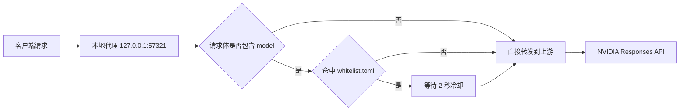

# Nvidia Rate Limiter ⚡

一款运行在本机的 NVIDIA Responses API 代理和限流器 🔧

它会监听 `127.0.0.1:57321`，把请求转发到上游接口，并且只对命中的 NVIDIA 模型做节流控制。

## 一眼看懂

- 代理转发 Responses API 请求
- 按模型白名单判断是否限流
- 默认对命中的请求添加 `2 秒` 冷却
- 支持 `install` / `uninstall` 命令注册为 Windows 计划任务
- 支持通过 `UPSTREAM_BASE_URL` 切换上游地址
- 自动读取同目录下的 `whitelist.toml`

## 工作原理



## 快速开始 🚀

1. 把 `nvidialimiter.exe` 和 `whitelist.toml` 放在同一个目录。
2. 直接运行程序。

```powershell
.\nvidialimiter.exe
```

默认行为：

- 监听：`127.0.0.1:57321`
- 上游：`https://integrate.api.nvidia.com/v1`

如果你要改上游地址：

```powershell
$env:UPSTREAM_BASE_URL = "http://127.0.0.1:8000"
.\nvidialimiter.exe
```

## 安装为开机启动 🪟

Windows 下可以使用计划任务注册开机启动：

```powershell
.\nvidialimiter.exe install
```

卸载：

```powershell
.\nvidialimiter.exe uninstall
```

## 配置文件 📄

程序会读取同目录下的 `whitelist.toml`。

示例：

```toml
enabled = true
match_mode = "mixed"

models = [
  "nvidia/"
]
```

### 配置项说明

- `enabled`
  - `true`：开启限流
  - `false`：关闭限流
- `match_mode`
  - `mixed`：精确匹配或前缀匹配
  - `prefix`：只做前缀匹配
  - `exact`：只做精确匹配
- `models`
  - 需要限流的模型列表

### 命中规则

只有当请求体里包含 `model` 字段，并且该模型命中白名单时，程序才会进行节流。

例如：

```json
{
  "model": "nvidia/llama-3.1-nemotron-70b-instruct",
  "input": "hello"
}
```

## 开发与验证 🧪

本地可以这样检查：

```powershell
go test ./...
go build .
```

## 推荐仓库信息 🏷️

- 项目简介：`一个本地运行的 NVIDIA Responses API 代理和限流器`
- 推荐 topics：`go`, `proxy`, `rate-limit`, `nvidia`, `responses-api`, `windows`

## 许可证

MIT License
