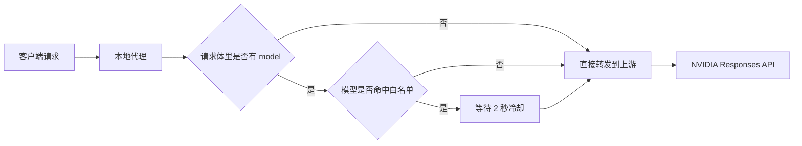
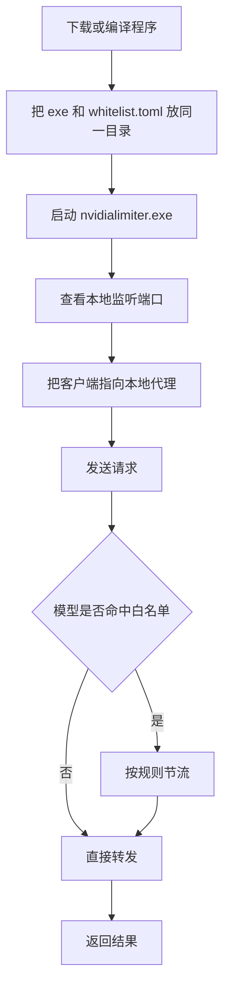

# Nvidia Rate Limiter ⚡

一个运行在本机的 NVIDIA Responses API 代理和限流器 🔧

它会把请求先接到你的本地电脑，再转发到 NVIDIA 上游接口，并且只对命中的 NVIDIA 模型做节流控制。

这个项目适合下面这些场景：

- 你想在本地统一转发 NVIDIA Responses API 请求
- 你想给某些模型加一个简单的冷却时间
- 你想让请求通过白名单控制，而不是对所有模型一视同仁

## 一眼看懂

- 代理转发 Responses API 请求
- 按模型白名单判断是否限流
- 默认对命中的请求添加 `2 秒` 冷却
- 支持 `install` / `uninstall` 命令注册为 Windows 计划任务
- 支持通过 `UPSTREAM_BASE_URL` 切换上游地址
- 自动读取同目录下的 `whitelist.toml`

## 它是怎么工作的



## 使用流程图



## 快速开始 🚀

### 第 1 步：准备文件

把 `nvidialimiter.exe` 和 `whitelist.toml` 放在同一个目录里。

### 第 2 步：启动程序

```powershell
.\nvidialimiter.exe
```

程序启动后会：

- 监听一个本地端口
- 把请求转发到 NVIDIA 上游接口
- 读取同目录下的 `whitelist.toml`

### 第 3 步：找到本地端口

如果你不确定程序监听了哪个端口，可以在 Windows 里这样查看：

```powershell
Get-NetTCPConnection -State Listen | Select-Object LocalAddress,LocalPort,OwningProcess
```

你也可以只看某个进程的端口。

示例说明：

- `127.0.0.1:<本地端口>` 只是示例写法
- 你电脑上的实际端口以程序日志或系统命令查询结果为准

### 第 4 步：测试请求

示例请求如下：

```json
{
  "model": "nvidia/llama-3.1-nemotron-70b-instruct",
  "input": "hello"
}
```

如果这个模型在白名单里，程序就会自动加上冷却。

## 上游地址

默认上游地址是：

```text
https://integrate.api.nvidia.com/v1
```

如果你想改成自己的上游，可以设置环境变量：

```powershell
$env:UPSTREAM_BASE_URL = "http://127.0.0.1:8000"
.\nvidialimiter.exe
```

## 安装为开机启动 🪟

在 Windows 上可以使用计划任务注册开机启动：

```powershell
.\nvidialimiter.exe install
```

卸载：

```powershell
.\nvidialimiter.exe uninstall
```

## 配置文件 📄

程序会读取同目录下的 `whitelist.toml`。

### 配置示例模板

你可以直接复制下面这份作为起点，再按自己的模型名修改：

```toml
# 是否启用限流
enabled = true

# 匹配模式：
# mixed  = 精确匹配或前缀匹配
# prefix = 只做前缀匹配
# exact  = 只做精确匹配
match_mode = "mixed"

# 需要限流的模型列表
models = [
  "nvidia/",
  "nvidia/llama-3.1-nemotron-70b-instruct",
]
```

示例：

```toml
enabled = true
match_mode = "mixed"

models = [
  "nvidia/"
]
```

### 配置项说明

- `enabled`
  - `true`：开启限流
  - `false`：关闭限流
- `match_mode`
  - `mixed`：精确匹配或前缀匹配
  - `prefix`：只做前缀匹配
  - `exact`：只做精确匹配
- `models`
  - 需要限流的模型列表

### 命中规则

只有当请求体里包含 `model` 字段，并且该模型命中白名单时，程序才会进行节流。

例如：

```json
{
  "model": "nvidia/llama-3.1-nemotron-70b-instruct",
  "input": "hello"
}
```

## 常见问题

### 1. 为什么启动后没反应？

先看程序窗口里有没有日志输出，通常会显示监听地址和上游地址。

### 2. 为什么我的配置没生效？

确认这几点：

- `whitelist.toml` 和程序在同一个目录
- `enabled = true`
- `models` 里写的是你实际请求的模型名

### 3. 为什么请求被 429 了？

这通常表示命中的请求正在排队，或者短时间内请求太密集。

### 4. 为什么没限流？

通常是因为：

- 请求体里没有 `model`
- `model` 没命中白名单
- `enabled = false`

## 开发与验证 🧪

本地可以这样检查：

```powershell
go test ./...
go build .
```

## 推荐仓库信息 🏷️

- 项目简介：`一个本地运行的 NVIDIA Responses API 代理和限流器`
- 推荐 topics：`go`, `proxy`, `rate-limit`, `nvidia`, `responses-api`, `windows`

## 许可证

MIT License
